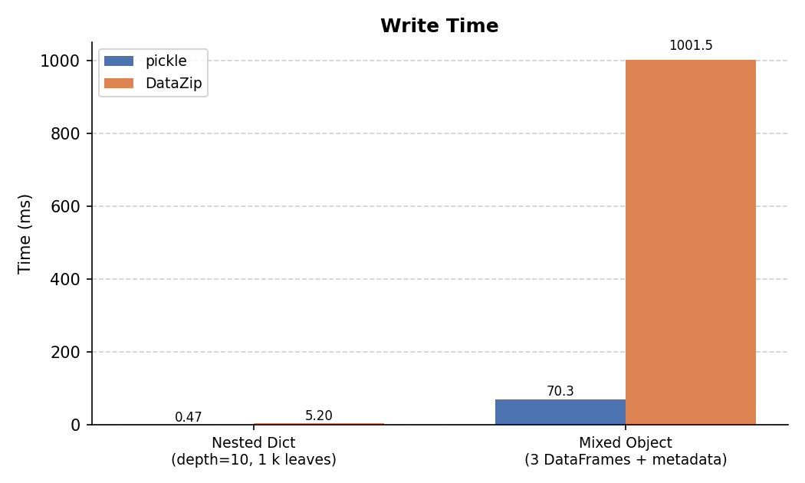
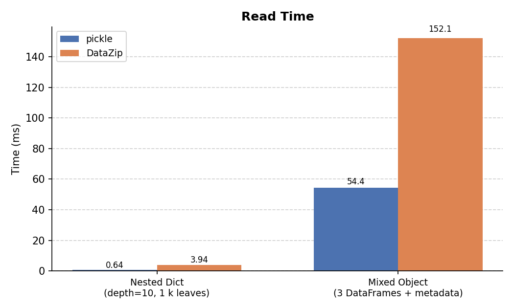
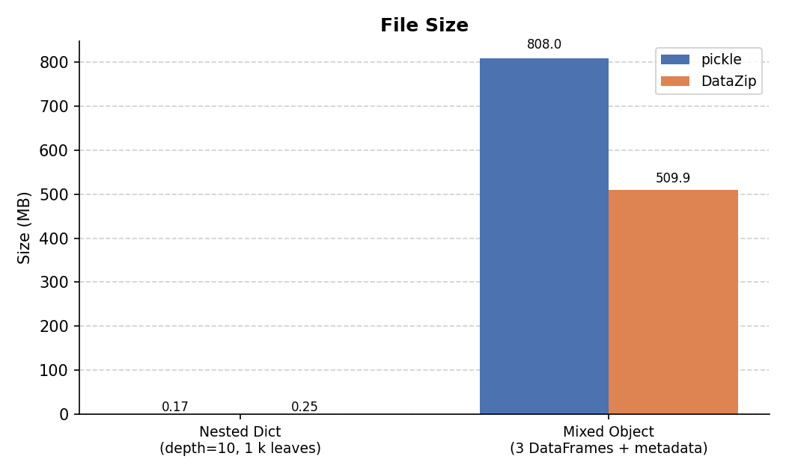
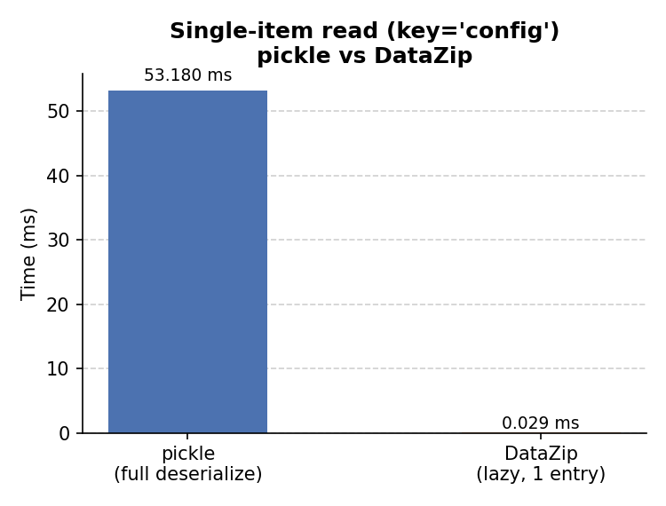

# Performance

This page compares DataZip against Python's built-in `pickle` module across two
representative workloads, measuring **write time**, **read time**, and **output file
size**. The figures and table below were produced by running
[`docs/benchmarks.py`](https://github.com/colectric-dev/datazip/blob/main/docs/benchmarks.py)
from the repository root.

## Methodology

| Parameter | Value |
|---|---|
| Repetitions | 7 (slowest dropped) |
| Timing | `time.perf_counter()` |
| I/O target | In-memory `BytesIO` (eliminates disk variability) |
| Machine | Apple M-series, macOS |

### Test objects

**Nested Dictionary — depth 10, branching factor 2**
: A recursively nested `dict` reaching 10 levels deep with 2 children per node
  (2¹⁰ = 1,024 leaf nodes). Each leaf holds a list of 50 integers, a float,
  a string, and a list of strings — representative of deeply nested
  configuration or tree data.

**Mixed Object — 3 DataFrames + metadata**
: A `dict` containing one large `DataFrame` (500k rows × 20 cols), two medium
  `DataFrame`s (50k rows × 10 cols each), a nested config `dict`, a `list` of
  200 category labels, and a description `str`. This represents a realistic
  analysis result or model output object.

  For DataZip, each top-level key is stored as a separate named entry in the
  archive (the natural DataZip usage pattern). For pickle, the entire `dict` is
  serialized as a single blob.

---

## Write Time



For the **nested dict**, pickle's binary protocol is faster because DataZip
serializes through JSON and wraps the result in a zip container.

For the **mixed object**, DataZip is slower on write because it encodes each
DataFrame to Parquet (which involves columnar compression), whereas pickle
writes raw NumPy buffers in a single pass.

---

## Read Time



For the **nested dict**, pickle's read is faster for the same reasons as write.

For the **mixed object**, DataZip's read is slower than pickle's due to the
Parquet decode step for each DataFrame, but remains practical even at these
sizes.

---

## File Size



This is where the trade-off becomes clear:

- **Nested dicts**: DataZip's JSON representation is larger than pickle's compact
  binary format (~11× in this case). DataZip uses `ZIP_STORED` (no compression)
  by default; passing `compression=ZIP_DEFLATED` would reduce this significantly.
- **Mixed object**: DataZip stores each DataFrame as **Parquet**, which applies
  columnar compression to numeric data. The combined archive is ~34% smaller
  than the pickle blob, and this advantage grows with larger DataFrames or more
  repetitive values.

---

## Partial / Lazy Read

A key advantage of DataZip's zip-based format is that **entries are independent**.
When you read a single key, only that entry is deserialized — the binary files
(Parquet, NumPy, …) stored for every other key are never opened.

`pickle` has no such capability: deserializing *any* part of a pickle blob
requires parsing the entire stream from the beginning.

The benchmark below reads one small key (`config`, a nested dict) from the
mixed object that also contains a 5 M-row DataFrame and two 50 k-row
DataFrames:

```python
# pickle — must deserialize all three DataFrames just to reach 'config'
obj = pickle.loads(data)
result = obj["config"]

# DataZip — reads only the 'config' JSON entry; Parquet files are never touched
with DataZip(io.BytesIO(data), "r") as z:
    result = z["config"]
```



DataZip is substantially faster here because the total work is proportional to
the size of the requested entry, not the size of the whole archive.

---

## Summary Table

Measurements from a single representative run:

| Benchmark | Write: pickle | Write: DataZip | Read: pickle | Read: DataZip | Size: pickle | Size: DataZip |
|---|---|---|---|---|---|---|
| Nested Dict (depth=10, 1 k leaves) | 0.5 ms | 5.2 ms | 0.6 ms | 3.9 ms | 0.17 MB | 0.25 MB |
| Mixed Object (3 DataFrames + metadata) | 70.3 ms | 1001.5 ms | 54.4 ms | 152.1 ms | 808.00 MB | 509.86 MB |

**Single-item read** — reading only `config` from the mixed object:

| | pickle (full deserialize) | DataZip (lazy, 1 entry) |
|---|---------------------------|-------------------------|
| Mixed Object → `config` key | 54 ms                     | 26 us |

---

## When to use DataZip vs pickle

|                                        | DataZip | pickle |
|----------------------------------------|---|---|
| Human-inspectable archive              | ✓ | ✗ |
| Smaller file for DataFrames            | ✓ | ✗ |
| Parquet interoperability               | ✓ | ✗ |
| Faster for nested dicts                | ✗ | ✓ |
| Faster for partial reads               | ✓ | ✗ |
| Safer (no arbitrary code exec on load) | ✓ | ✗ |
| Reproducible across Python versions    | ✓ (mostly) | ✗ |

!!! tip "Reducing DataZip file size for nested structures"
    Pass `compression=ZIP_DEFLATED` to enable zip compression:

    ```python
    with DataZip("data.zip", "w", compression=ZIP_DEFLATED) as z:
        z["nested"] = my_dict
    ```

    or via the mixin:

    ```python
    from zipfile import ZIP_DEFLATED
    obj.to_file("data.zip", compression=ZIP_DEFLATED)
    ```

!!! note "Regenerating figures"
    To reproduce these benchmarks on your own machine:

    ```bash
    pip install datazip[docs]
    python docs/benchmarks.py
    ```
